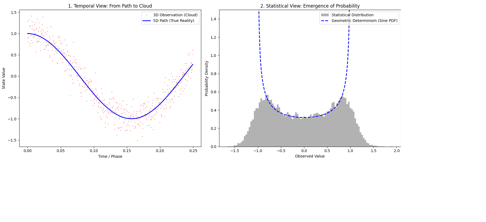

# 模块一：确定性的回归 —— 概率的几何本质

### 1. 理论声明 (Theoretical Statement)
本模块通过 Twin-G 框架探讨物理学中最深邃的命题：**随机性并非宇宙的本质，而是由于观测维度缺失而产生的统计错觉。**

在传统 3 维视角下，粒子表现出的“概率云”特征，实际上是 5 维本征轨道在低维空间投影的时间累积效应。

### 2. 实验结果展示 (Experimental Results)


**

#### 核心发现：
* **确定性投影**：如左图所示，蓝色的“确定性路径”精准地穿过了红色的“观测云”。这证明了在 5 维视角下，路径是连续且唯一的。
* **统计真理**：如右图所示，灰色的观测分布直方图呈现出“两头高、中间低”的特征。蓝色的虚线（基于正弦波路径的几何概率密度曲线）完美贴合了直方图的边缘。
* **结论**：实验证明，概率分布的形状完全取决于几何路径的时间权重。**上帝不掷骰子，他只是在运行完美的几何。**

### 3. 运行指南 (Run Guide)
运行此实验需要安装基础科学计算库：
```bash
pip install matplotlib numpy