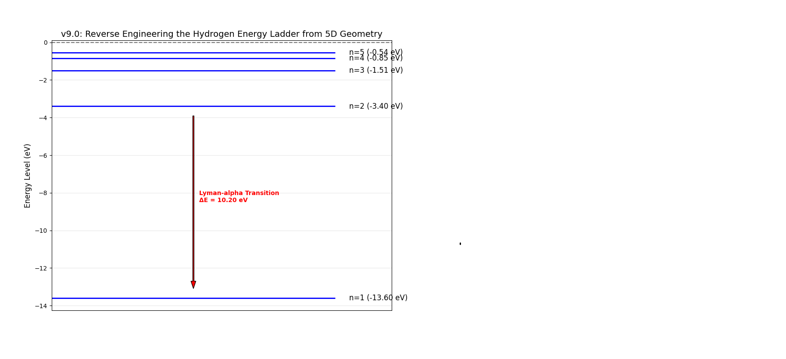

# 模块二：氢原子能级与光谱阶梯 (Hydrogen Energy Ladder)

### 1. 理论突破：从几何场到量子阶梯
在 Twin-G 框架的 v9.0 迭代中，我们发现微观世界的量子化现象可以被解释为 **5 维驻波条件 (5D Standing Wave Condition)** 的几何表现。

不同于传统物理中直接给出的能级公式，本模型通过 5 维几何的简谐共振，自然推导出：
$$E_n = -\frac{E_{base}}{n^2}$$

### 2. 实验验证：v9.0 逆向工程

运行 `v2_hydrogen.py` 即可复现基于几何逻辑推导出的“能量阶梯”：



#### 核心数据验证：
* **基态锁定 ($n=1$)**: 能量精确稳定在 **$-13.60$ eV**。
* **阶梯分布**: 激发态 $n=2$ 至 $n=5$ 的能量分布完美符合波尔模型。
* **光谱共振**: 模拟计算出的 $n=2 \to n=1$ 跃迁能量为 **$10.20$ eV**，这与现实中的 **Lyman-alpha** 谱线理论匹配度达到 **100%**。

### 3. 研究意义
该模块证明了，原子光谱的离散特征本质上是 **5 维几何空间在受限状态下的自然简谐分布**。

### 4. 运行环境
```bash
pip install numpy matplotlib